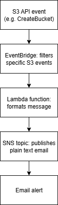
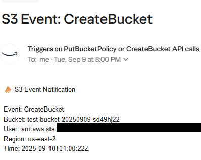

# Clean SNS email notifications for S3 bucket events

This project shows you how to use AWS Lambda + EventBridge + SNS to send clean, readable email notifications for specific S3 bucket events, like `CreateBucket` or `PutBucketPolicy`. Instead of receiving large raw JSON in emails, this solution formats key event details into a simple, readable message.

## What problem does this solve?

AWS SNS notifications for S3 events (via EventBridge) are often cluttered with raw JSON.
This solution makes them clean and human-readable, like this:

```vbnet
S3 Event Notification

Event: CreateBucket
Bucket: my-new-bucket
User: arn:aws:iam::123456789012:user/amy
Region: us-east-2
Time: 2025-09-09T14:32:10Z
```

## Who is this for?

- AWS beginners learning about Lambda, EventBridge, and SNS.
- DevOps engineers who want clearer AWS event alerts.
- Anyone tired of reading raw JSON in SNS emails!

## Prerequisites

1. Install AWS CLI
2. Configure your credentials: `aws configure` or `aws configure sso`
3. Your IAM user should have permissions for Lambda, SNS, and EventBridge.
4. Subscribe your email address to the SNS topic (`S3-Resource-Change-Topic`) and confirm the subscription in your email. You can do this using the AWS Console or CLI.

   <details>
   <summary>Click to show SNS subscription CLI command</summary>

   ```bash
   aws sns subscribe \
     --topic-arn arn:aws:sns:us-east-2:YOUR_ACCOUNT_ID:S3-Resource-Change-Topic \
     --protocol email \
     --notification-endpoint your-email@example.com

</details>

5. You should also have these AWS resources already created:

   - SNS Topic (named `S3-Resource-Change-Topic` in this example)
   - EventBridge Rule (named `Notify-S3-Resource-Change` for this example)
      - Event Pattern: Filtering on PutBucketPolicy and CreateBucket S3 events

## What events are tracked?

This setup tracks these two S3 control plane actions:
- `CreateBucket`
- `PutBucketPolicy`

You can customize the EventBridge rule to track more.

## How it works

1. EventBridge listens for specific S3 API calls.
2. It sends matching events to a Lambda function.
3. The Lambda function:
   - Parses the event
   - Extracts key info
   - Sends a formatted message to SNS
4. SNS sends that message via email.

## Logic flow diagram



## Lambda function code (sns_cleaner.py)

<details> <summary>Click to expand Lambda function code</summary>

```python
import json
import boto3
import os

sns = boto3.client('sns')
SNS_TOPIC_ARN = os.environ['SNS_TOPIC_ARN']

def lambda_handler(event, context):
    print("Raw event:", json.dumps(event))

    detail = event.get('detail', {})
    event_name = detail.get('eventName', 'UnknownEvent')
    bucket_name = detail.get('requestParameters', {}).get('bucketName', 'UnknownBucket')
    user = detail.get('userIdentity', {}).get('arn', 'UnknownUser')
    region = event.get('region', 'UnknownRegion')
    time = event.get('time', 'UnknownTime')

    message = f"""📣 S3 Event Notification

Event: {event_name}
Bucket: {bucket_name}
User: {user}
Region: {region}
Time: {time}
"""

    sns.publish(
        TopicArn=SNS_TOPIC_ARN,
        Subject=f"S3 Event: {event_name}",
        Message=message
    )

    return {
        'statusCode': 200,
        'body': json.dumps('Notification sent!')
    }
```
</details>

## Deployment steps

<details>
<summary>Click to expand deployment commands (PowerShell)</summary>

```powershell
# Step 1: Create IAM Role for Lambda

# First, create a file named trust-policy.json with the following content:
# This trust policy allows AWS Lambda to assume the role.

# trust-policy.json
# {
#   "Version": "2012-10-17",
#   "Statement": [
#     {
#       "Effect": "Allow",
#       "Principal": {
#         "Service": "lambda.amazonaws.com"
#       },
#       "Action": "sts:AssumeRole"
#     }
#   ]
# }

# Then run this `create-role` command using the trust-policy file:

aws iam create-role `
  --role-name lambda-sns-cleaner-role `
  --assume-role-policy-document file://trust-policy.json

# Step 2: Attach required permissions to the role
aws iam attach-role-policy `
  --role-name lambda-sns-cleaner-role `
  --policy-arn arn:aws:iam::aws:policy/service-role/AWSLambdaBasicExecutionRole

aws iam attach-role-policy `
  --role-name lambda-sns-cleaner-role `
  --policy-arn arn:aws:iam::aws:policy/AmazonSNSFullAccess

# Step 3: Zip your Lambda function code
Compress-Archive -Path sns_cleaner.py -DestinationPath function.zip

# Step 4: Create Lambda function
aws lambda create-function `
  --function-name CleanS3EventNotifier `
  --runtime python3.13 `
  --role arn:aws:iam::YOUR_ACCOUNT_ID:role/lambda-sns-cleaner-role `
  --handler sns_cleaner.lambda_handler `
  --zip-file fileb://function.zip `
  --environment Variables="{SNS_TOPIC_ARN=arn:aws:sns:us-east-2:YOUR_ACCOUNT_ID:S3-Resource-Change-Topic}" `
  --region us-east-2

# Step 5: Create targets.json file

# Why create this file? Passing complex JSON inline can be error-prone (especially in PowerShell).
# Using this file makes the command easier to manage and more portable.

# Contents of targets.json:
# [
#   {
#     "Id": "CleanS3NotifierTarget",
#     "Arn": "arn:aws:lambda:us-east-2:YOUR_ACCOUNT_ID:function:CleanS3EventNotifier"
#   }
# ]

# Step 6: Add the Lambda function as a target to EventBridge rule
aws events put-targets `
  --rule Notify-S3-Resource-Change `
  --targets file://targets.json `
  --region us-east-2

# Step 7: Grant EventBridge permission to invoke the Lambda
aws lambda add-permission `
  --function-name CleanS3EventNotifier `
  --statement-id AllowExecutionFromEventBridge `
  --action lambda:InvokeFunction `
  --principal events.amazonaws.com `
  --source-arn arn:aws:events:us-east-2:YOUR_ACCOUNT_ID:rule/Notify-S3-Resource-Change `
  --region us-east-2
```
</details>

## Email notification screenshot

<details> <summary> <strong>Sample email notification output</strong> (click to expand)</summary>




</details>

## Design highlights

- Clean output: Easy-to-read messages instead of raw JSON
- EventBridge decouples services: Flexible and scalable
- Least privilege IAM roles
- Environment variables keep things configurable
- Easy to extend to other AWS services and events

## AWS services stack

- AWS Lambda (Python)
- Amazon SNS (email alerts)
- EventBridge (for triggering Lambda)
- S3 (as source)

## What I learned

- AWS Lambda can effectively transform raw event data into user-friendly notifications.
- Managing AWS permissions is critical to allowing seamless interaction between EventBridge, Lambda, and SNS.
- Avoid duplicate SNS notifications by ensuring only Lambda publishes to SNS, not EventBridge directly.
- AWS CLI commands often require careful syntax, especially for JSON parameters.
- S3 bucket names are globally unique, and region constraints must be specified correctly.
